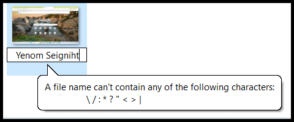
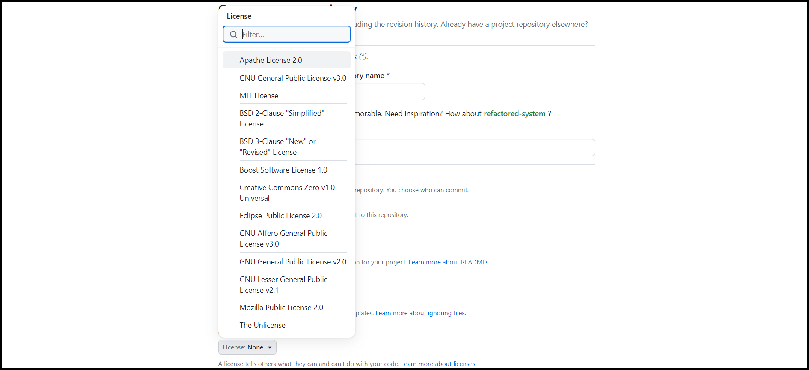
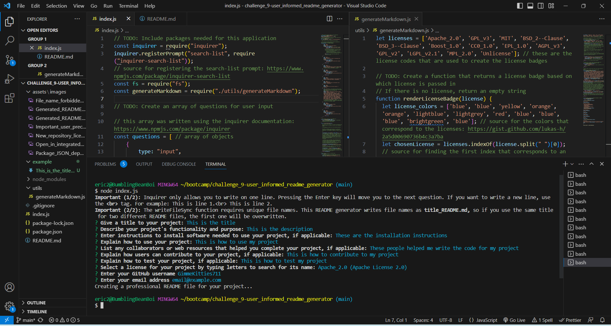
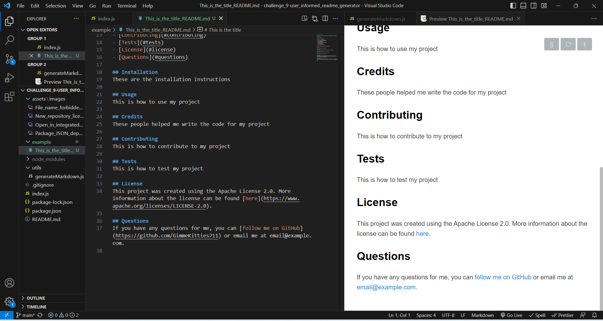

# Challenge 9: User-informed Professional README Generator

## Description

It is important for any GitHub project to be supported by good documentation explaining what the project does and how to use it. This can be accomplished with a README file that presents the information thoroughly and in an organized manner. This project writes README files by asking the user questions in the command line. The user's responses are then inserted into the corresponding sections of the README file, which is more convenient than writing READMEs manually. I learned how to use inquirer to prompt the user and process their responses, work with RegExp and string literals, and write a function that returns Markdown.

## Table of Contents

- [Description](#description)
- [Installation](#installation)
- [Usage](#usage)
- [Credits](#credits)
- [Contributing](#contributing)
- [Tests](#tests)
- [License](#license)
- [Questions](#questions)

## Installation

Before running the program, you must open the index.js file in the integrated terminal:

and type in the terminal:

    npm install

This will install all of the node modules from the **inquirer** and **inquirer-search-list** packages, as shown in the package dependencies:

## Usage

This program is initialized by typing the following text in the terminal:

    node index.js

You will be asked some questions, and your answers will be used in the README. There are two things to be aware of as you are providing your answers:

1. Inquirer only allows you to write on one line. Pressing the Enter key will move you to the next question. If you want to write a new line, use the **br** tag:

2. The writeFileSync function requires unique file names. This README generator writes file names as **title_README.md,** so if you use the same title for two different README files, the first one will be overwritten.

**Important:** to avoid file naming issues, some characters in the title are modified before the title is inserted into the file name. Spaces and tab characters are replaced with underscores, and the following special characters are replaced with dashes:

The licenses that you can choose from are shown in the following image:

The following screenshots demonstrate the appearance of the application:

A **walkthrough video** demonstrating this project in action can be found [here](https://www.youtube.com/watch?v=K2HNEFVI21M).

## Credits

Asked questions in the *# 02-ask-the-class* channel on Slack and received assistance from student Jesus Santos, TAs Elena Rogers and Michael Seaman, and instructor Robbert Wijtman.

The following web resources helped me write the code for this project:
1. [Registering the search-list prompt for inquirer](https://www.npmjs.com/package/inquirer-search-list?activeTab=readme)
2. [Inquirer documentation](https://www.npmjs.com/package/inquirer)
3. [writeFileSync method](https://www.geeksforgeeks.org/node-js-fs-writefilesync-method/)
4. [Why spaces might cause issues for file systems](https://superuser.com/questions/29111/what-technical-reasons-exist-for-not-using-space-characters-in-file-names)
5. [How to use RegExp](https://developer.mozilla.org/en-US/docs/Web/JavaScript/Guide/Regular_expressions)
6. [Special character unicode](https://owasp.org/www-community/password-special-characters)
7. [Tab character unicode](https://stackoverflow.com/questions/9660987/how-to-get-a-tab-character)
8. [replace method in strings](https://www.w3schools.com/jsref/jsref_replace.asp)
9. [Console logging bold text using ANSI escape sequences](https://developer.chrome.com/docs/devtools/console/format-style/#style-ansi)
(ANSI = American National Standards Institute)
10. [License badge colors](https://gist.github.com/lukas-h/2a5d00690736b4c3a7ba)
11. [indexOf method in arrays](https://developer.mozilla.org/en-US/docs/Web/JavaScript/Reference/Global_Objects/Array/indexOf)
12. [split method in strings](https://www.w3schools.com/jsref/jsref_split.asp)
13. [slice method in strings](https://developer.mozilla.org/en-US/docs/Web/JavaScript/Reference/Global_Objects/Array/slice)

## Contributing
Contribution is not necessary for this project.

## Tests
Tests have not been written for this application.

## License
No license is attached to this project.

## Questions
If you have any questions for me, you can [follow me on GitHub](https://github.com/GimmeKitties711) or email me at eric20wang.wang@gmail.com.
