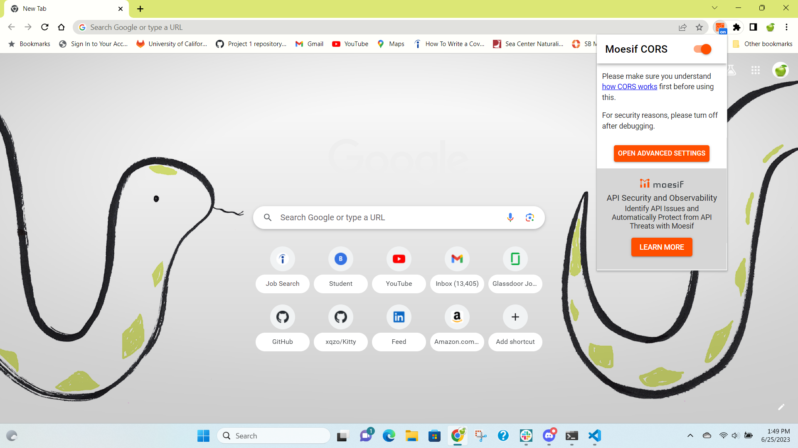
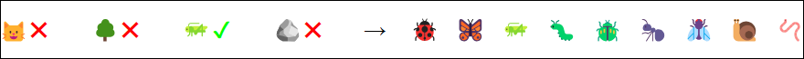

# Nature Quest

## Description
Kitty Quest, created by [Antonio](https://github.com/xqzo) and [Eric](https://github.com/GimmeKitties711), was a project that had users click a button and provided a cat-related fact and image, and clicking the save button would save the image in localStorage and download the image to the user’s computer. Now we have expanded the project to be about more than just cats. Not only can you choose many types of animals, you can choose different types of organisms such as plants and insects, and even inanimate objects like rocks.

## Table of Contents
- [Description](#description)
- [Installation](#installation)
- [Usage](#usage)
- [Credits](#credits)
- [Contributing](#contributing)
- [Tests](#tests)
- [License](#license)
- [Questions](#questions)

## Installation
Just like last time, the [Moesif Origin & CORS Changer](https://chrome.google.com/webstore/detail/moesif-origin-cors-change/digfbfaphojjndkpccljibejjbppifbc) is required to circumvent the restrictions imposed by [CORS (Cross-Origin Resource Sharing) policy](https://www.moesif.com/blog/technical/cors/Authoritative-Guide-to-CORS-Cross-Origin-Resource-Sharing-for-REST-APIs/). A reminder of the browser’s appearance with the extension turned on:    

## Usage
The webpage starts with options for broad categories (e.g. animal, plant, insect). Once the user chooses one of them, they are presented with more specific options from that category. For example, choosing insect would lead to a menu with options such as ladybug, beetle, and snail. Once an option is chosen, a button appears with the text “Click for a random ladybug fact and image” (ladybug is an example). Clicking this button reveals the prompt, “Which of these would you like to save?” next to three buttons:    - Image   - Fact   - Both    These buttons decide which file(s) are downloaded. The fact is downloaded as a .txt file with the file name ‘ladybug_fact_[number of ladybug facts that have been downloaded].txt’. The appearance of the category selector is shown in the following image:    

## Credits
As we worked on expanding Kitty Quest, we used many informative reb resources and received assistance from the instructional staff, particularly TA Elena Rogers and instructor Robbert Wijtman. (hypothetically)

## Contributing
If you would like to suggest a creature that we did not include, feel free to reach out to us. You can find our contact information in the [Questions](#questions) section.

## Tests
We have not written tests for Nature Quest yet, but we are looking to do so in the future.

## License
This project was created using the MIT License. More information about the license can be found [here](https://opensource.org/license/mit/).

## Questions
If you have any questions for me, you can [follow me on GitHub](https://github.com/GimmeKitties711) or email me at eric20wang.wang@gmail.com.
